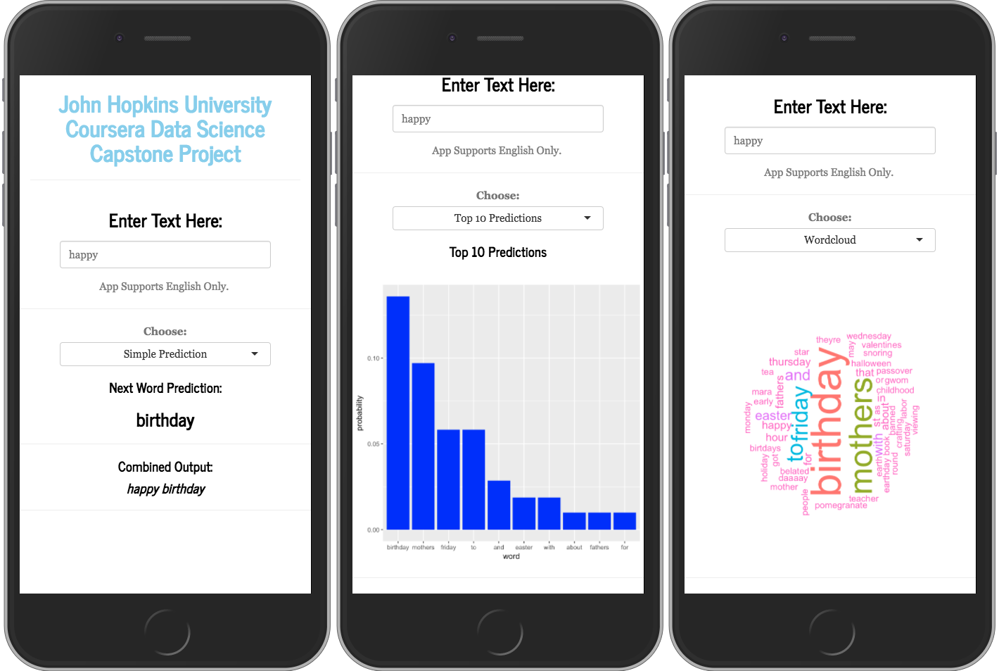

Capstone Project:
========================================================
# Word Prediction Application
Andrew Rosa

Summary
========================================================

This project was done for the Data Science Specialization 
by John Hopkins University on **Coursera**.

Here we use a large corpus comprised of tweets, various blogs,
and news scourses to model a word prediction application. 

The model is based off the **Markov** assumption, which dictates that 
the entire sentance does not need to be used to predict the next 
word, but only the last few proceeding words. 

The final producted is showcased on:
https://punkfooddisme.shinyapps.io/JHDSCapstone/

Procedure
========================================================
### Here are the basic steps:

1. Download, load, and clean corpus  
2. Create three **n_gram** data-sets. One for tri-grams, bi-grams, and
single words. Then calculate the frequncy of occurances.
3. Implement a weighting system to discount grams with frequencies 
less than 5. 
4. Calculate the **conditional probability** for each gram. Formula: 
$\text{P}\left(w_{n}|w_{1}\ldots w_{n-1} \right)=\frac{\text{P}\left(w_{1}\ldots w_{n}\right)}{\text{P}\left(w_{1}\ldots w_{n-1}\right)}$ 
5. Implemtent **Katz's backoff** method in predictive model. 

Katz's Backoff Method
========================================================

Our model's top level comes from our tri-gram data set. If the two
proceding words are not found in the trigram data-set the model 
backs off to the bi-gram set and redistributs the probabilities. 
If the prediction isn't located in the bi-gram set, the process 
happens again and backs off to the single word set. 

Application
========================================================

Finally Our app allows you to type in text and recieve the prediction
in three different ways. You can choose to see simple prediction 
which will just depect the next predicted word and the combined 
sentance. The second choice shows you a barchart with probabilities 
for the top ten choices. The final option depects a word cloud of
possibilities.

========================================================

https://punkfooddisme.shinyapps.io/JHDSCapstone/

 https://github.com/PunkFood-Disme/JHDSCapstone

 https://www.rosaanalytics.com/

